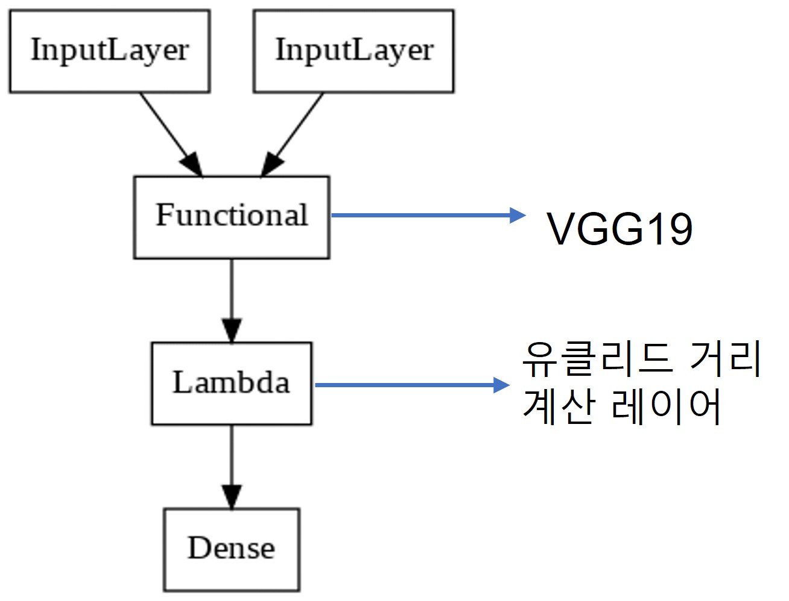
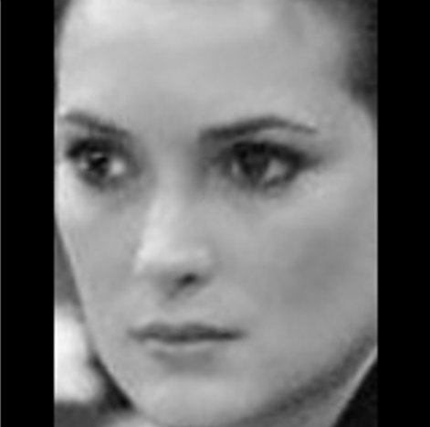
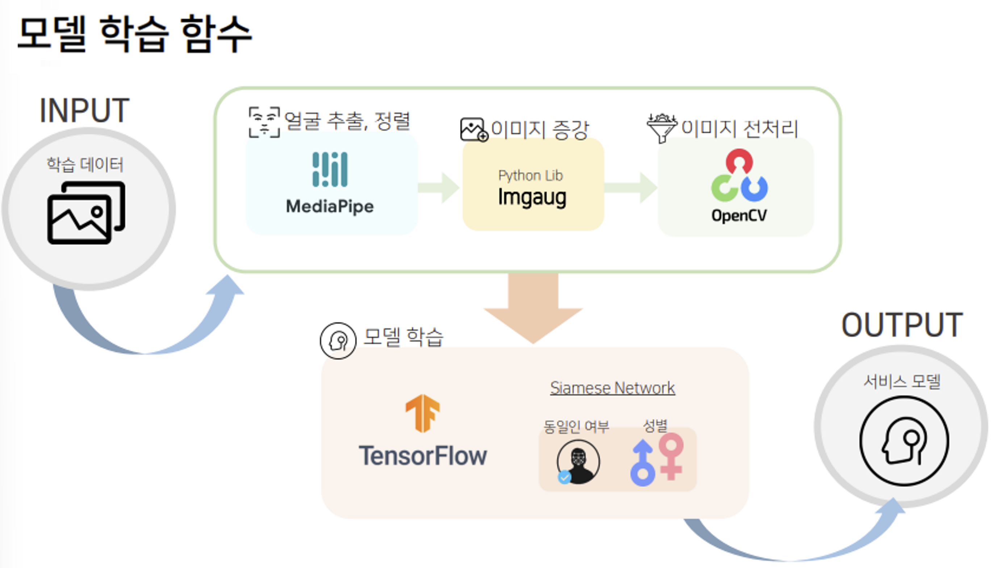

# **👩회원 인증을 위한 얼굴 인식 모델👨**
> **❗해당 프로젝트의 기업명 및 코드는 기업측 요청으로 비공개 처리 하였습니다.**
------
## **📝프로젝트 개요**
- 해당 프로젝트는 코드스테이츠 AI부트캠프 14기 기업 협업 팀 프로젝트로, 시니어 50대 ~ 60대 들을 위한 데이팅 앱을 런칭한 기업의 회원 인증을 위한 얼굴 인식 모델에 대한 프로젝트입니다.
------
## **✏️프로젝트 목표**
- 유저가 많아짐에 따라 처리해야하는 데이터 양이 많아지므로 AI 모델을 이용하여 업무량을 낮추는 것이 목표
    - Python을 활용한 AI 모델 개발을 통한 회원 가입 이후 본인 인증 시스템을 자동화
    - 회원의 갤러리 사진과 인증용 촬영 사진 속 얼굴 인식 후 두 사진의 얼굴을 대조하여 동일인 여부 및 성별 판별
    - 성별 예측 80%
    - 실행 시간 : 1초 ~ 2초 내
------
## **📅프로젝트 기간**
- 2022년 11월 18일 ~ 2022년 12월 12일
------
## **🧑‍💻역할 구성**
- [서용석](https://github.com/seo8seok)
 : 팀장 | EDA, 얼굴 감지 및 정렬
- [신지민](https://github.com/jayJ-hub)
: 팀원 | DB, 이미지 전처리, 이미지 증강
- [이다인](https://github.com/dainleeee)
: 팀원 | 데이터 라벨링, 동일인 및 성별 판별 모델 구축
------
## **💻사용 기술**
- `env`

    

- `DB`

    

- `preprocess`

    

- `model`

    

------
## **💼최종 Workflow Pipeline**

1. 기업측으로부터 회원ID, 성별, 유저 갤러리 사진 링크, 인증용 사진 링크로 구성된 엑셀 파일을 제공받음
2. 위 데이터들을 MySQL을 활용하여 DB에 적재
3. 필요한 데이터들은 위 DB로부터 불러와 사용
4. 불러온 이미지에서 얼굴을 찾고 정렬을 진행
    - face detection : mediapipe를 사용하여 얼굴 찾음 mobilenetV2를 개선시킨 blazeface 사용, 6개의 랜드마크(눈(2),코,입,귀(2))를 이용해 얼굴을 찾음
    - face alignment : mediapipe를 사용하여 눈 위치 좌표를 찾고, 이를 기준으로 얼굴 정렬 및 크롭
5. 데이터 수가 많지 않으므로 이미지 수를 늘리기 위해 증강 작업 눈, 코, 입 중 랜덤으로 한 부분이 블러 처리됨
    - image agumentation : imgaug 라이브러리를 사용하여 학습용 데이터를 증가 시킴
6. 학습에 용이하도록 이미지 흑백, 평탄화 처리를 적용
    - face filter : opencv 라이브러리 사용
7. 사전 학습 모델인 facenet을 사용하여 siamese network 구조로 모델을 구축.
    - face verification : facenet은 얼굴 사진에서 그 사람에 대한 특징 값을 구해주는 모델로 128차원의 임베딩값 생성
8. 모델을 활용해 동일인 여부 및 성별을 판별
    - 예측값과 실제값이 다를 경우 표본 사이의 거리를 최대화 하고, 같을 경우 최소화 해주어 네트워크가 주어진 이미지 쌍을 얼마나 잘 구별하는지 평가하는 함수인 대조 손실 함수를 사용
------
## **📂사용 데이터**
1. 기업 제공 유저 데이터
    
    - 회원번호 ID
    - 성별
    - 98명에 대한 196장의 얼굴 이미지
        - 유저의 갤러리 사진 
        - 유저의 인증용 사진
    -  기존 유저 169장의 얼굴 이미지는 훈련 및 검증 데이터로, 11월 28일 이후 신규 가입자에 대한 27장의 얼굴 이미지로는 최종 모델 테스트용으로 사용되었음.
2. LFW 얼굴 이미지
    - 유명 정치인 등의 실제 얼굴에 대한 이미지 데이터
    - sklearn.dataset에서 fetch_lfw_people() 함수로 로드하여 사용
    - 62명에 대한 약 3000장의 얼굴 이미지 사용
    - 직접 라벨링한 성별 정보
------
## **🔗네트워크 구조**
### **· 샴 네트워크**
- 두 사진을 입력받아 동일한 CNN 네트워크를 통과시켜 두 이미지로부터 임베딩 값을 각각 추출하여 임베딩 벡터간의 거리를 구하고, 그 거리에 대한 유사도 값을 출력하는 구조

### **· 샴 네트워크 수행 절차**
1. 긍정 및 부정 데이터 쌍 준비
    - 긍정쌍 : 두 이미지가 모두 동일인일 경우

        

    - 부정쌍 : 두 이미지가 비동일인으로 구성되었을 경우

        

2. 파라미터를 공유하는 CNN을 통과시켜 각 이미지에 대한 임베딩 값 추출
3. 두 임베딩 값 사이의 유클리드 거리 계산
4. 시그모이드 활성화 함수를 통해 유사도 출력
    - 0에서 1사이의 값을 출력
    - 유사도가 1에 가까울수록 두 이미지가 유사함을 의미
    - 유사도가 0에 가까울수록 두 이미지가 유사하지 않음을 의미
    - 유사성 컷오프 임계값을 0.5로 설정
    - 0.5 이상이면 동일인, 0.5 이하이면 비동일인으로 판별
------
## **➡️진행 과정**
### **1) 자체 모델 구축**
|모델명|모델 구조|설명|정확도|
|:---:|:---:|:---:|:---:|
|자체 모델||- 두개의 인풋을 받아 자체로 만든 CNN을 통과시킨 후 유클리드 거리 계산 레이어를 거쳐 시그모이드 활성 함수를 통해 유사도 출력   - 이미지의 특징을 찾아주는 컨볼루션 레이어와 가로세로 방향의 공간을 줄여주는 풀링 레이어, 과적합은 막는 드롭아웃 레이어를 반복하여 구성|27%|

➜ **정확도가 27%로 매우 낮아 사전학습 모델 사용, 이미지 전처리에 따른 비교, 손실 함수에 따른 비교, 증강 이미지 사용 여부에 따른 비교 등을 실험해보며 성능 개선에 도전함.**
### **2) 모델 비교**
|모델명|모델 구조|설명|정확도|
|:---:|:---:|:---:|:---:|
|VGG19||- 위의 자체모델 구조에서 자체로 만든 CNN을 대신해 VGG19 사전학습 모델을 통과   - VGG 사전 모델은 3x3 컨볼루션 레이어만 사용하는 것이 특징   - **학습 테스트 결과 모든 이미지 쌍을 비동일인으로 예측하였음**|73%|
|**`FaceNet`**||- 위의 자체모델 구조에서 자체로 만든 CNN을 대신해 FaceNet 사전학습 모델을 통과   - FaceNet은 얼굴 사진에서 그 사람에 대한 특징 값을 구해주는 모델로 160*160의 이미지를 가져와 128차원의 임베딩을 생성해주는 모델|**`73%`**|

- 자체 모델은 27%, VGG와 FaceNet은 73% 정확도를 보였으나 VGG는 모든 이미지쌍을 비동일인으로 예측해버려 최종 모델에는 FaceNet을 적용하기로 하였음
------
### **3) 이미지 전처리에 따른 비교**
|전처리|예시|정확도|비고|
|:---:|:---:|:---:|:---:|
|흑백||78%||
|**`흑백+평탄화`**||**`94%`**|평탄화 : 이미지의 명암 대비를 개선하여 선명도를 높이는 작업|
|컬러||83%||
------
### **4) 성별 판별 추가**
|모델 구조|동일인 판별 정확도|성별 판별 정확도|비고|
|:---:|:---:|:---:|:---:|
||83%|100%|테스트 데이터에 성별이 남성 밖에 존재하지 않아 매우 높은 정확도가 나타난 것으로 보임|
-------
### **5) 동일인 판별 시 손실 함수에 따른 비교**
- 손실함수 : 실제값과 딥러닝을 통해 예측한 값이 얼만큼의 손실, 오차가 있는지를 구하는 함수
- 샴 네트워크 사용 시 주로 사용되는 손실 함수 중 이진 교차 엔트로피와 대조 손실 함수를 비교하였음
 

|손실 함수|설명|동일인 판별 정확도|
|:---:|:---:|:---:|
|이진 교차 엔트로피 함수|이징 분류에 사용되는 손실함수로 예측값과 실제값이 같은 경우 손실 함수 값을 0으로, 다를 경우 양의 무한대로 수렴|83%|
|**`대조 손실 함수`**|예측값과 실제값이 다를 경우 표본 사이의 거리를 최대화 하고, 같을 경우 표본 사이의 거리를 최소화|**`83%`**|
 
- 두 손실함수 모두 결과가 비슷했으나, 샴 네트워크의 목적은 입력 이미지를 분류하는 것이 아니라 구별하는 것으로 교차 엔트로피 보다는 대조 손실 함수를 사용하는 것이 더 적합하고 대조 손실 함수는 네트워크가 주어진 이미지 쌍을 얼마나 잘 구별하는지 평가하는 함수이므로 대조 손실 함수 채택

-------
### **6) 증강된 이미지 포함 여부에 따른 비교**
|증강 포함 여부|예시|동일인 판별 정확도|성별 판별 정확도|
|:---:|:---:|:---:|:---:|
|미포함||64%|93%|
|**`포함`**| (눈, 코 입 중 랜덤 한 부분이 블러 처리)|**`64%`**|**`93%`**|

- 증강 포함, 미포함 모두 동일인 및 성별 판별 정확도가 비슷했으나, 학습에 사용되는 데이터 수가 많지 않으므로 증강 포함하여 학습 진행하기로 하였음

------
## **🖇️최종 모델 구조**

- 다중 입출력 구조
- FaceNet 사전 학습 모델 이용
- 학습에 사용될 이미지는 흑백+평탄화 전처리
- 기업 제공 데이터에 이미지 증강 적용하여 학습
- 대조 손실 함수 사용
- 샴 네트워크로 두 개의 이미지를 Input으로 받아 동일인 여부를 판단
- 두 개의 이미지 중 input_1이미지(인증용 사진)로 성별을 판단
------
## **📌최종 결과**
> 최종 결정된 모델 구조로 실제 회원 이미지를 통해 테스트해 본 결과
- ### **동일인 판별 정확도 : 75%**
- ### **성별 판별 정확도 : 93%**
- ### **모델 소요 시간 : 약 0.8초**
------
## **👍성과**
- 목표사항 모두 만족
    - Python을 활용하여 두 장의 사진에서 얼굴 인식 후 동일인 여부 및 성별 판별 AI 모델 구축 완료
        > **기업측에 두 가지 함수를 제공함**
        ### **1. 모델 학습 함수**

        

        - 회원 수가 증가함에 따라 새로운 데이터로 추가 학습을 진행하기 위한 모델 학습 함수
        - INPUT : 학습할 이미지, 성별 데이터
        - PROCESS : 얼굴 추출 및 정렬 -> 이미지 증강 -> 이미지 전처리 -> 모델 학습
        - OUTPUT : 동일인 여부 및 성별 판별 모델
        ------
        ### **2. 서비스 모델 함수**

        

        - 최종적으로 인증 및 프로필 사진을 입력하면 동일인 여부 및 성별을 예측 후 결과를 출력해주는 함수
        - INPUT : 인증용 사진, 프로필 사진
        - PROCESS : 동일인 여부 판별 및 성벌 예측
        - OUTPUT : 동일인 일치 여부(True/False), 예측한 성별(Male/Female) 
        ------

    - 성별 예측 목표 정확도(80%)보다 높은 93% 정확도 달성
    - 목표 소요시간(2초 내)보다 더 적은 소요시간(0.8초) 달성
- 일간 회의를 통해 프로젝트 진행도를 확인하며 Git 협력
- 베이스 모델을 기준으로 다양한 전처리와 모델 테스트를 통해 성능 개선
- 빠른 인증 시스템으로 고객들의 편리한 이용 가능
- 인증 자동화로인해 업무의 효율성 증가
------
## **✍️한계점 및 해결 방안**
- 모델의 학습데이터에 과적합 의심 및 적은 데이터 수
    - 마스크를 착용한 사진 제외하고 학습 필요
    - 어플의 컨셉에 맞게 LFW 얼굴 이미지 보다는 동양인 시니어 사진들을 크롤링하고, 더 다양한 이미지 증강 추가 진행 필요
